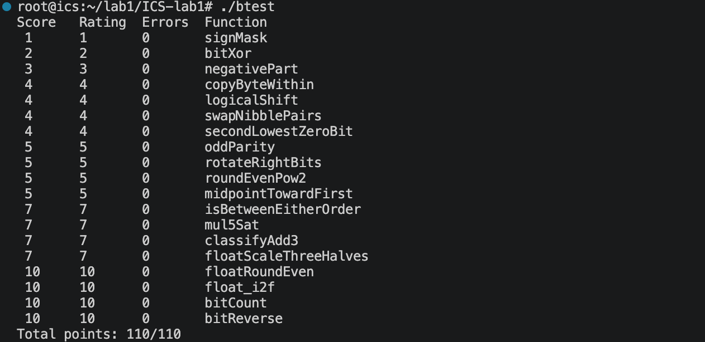
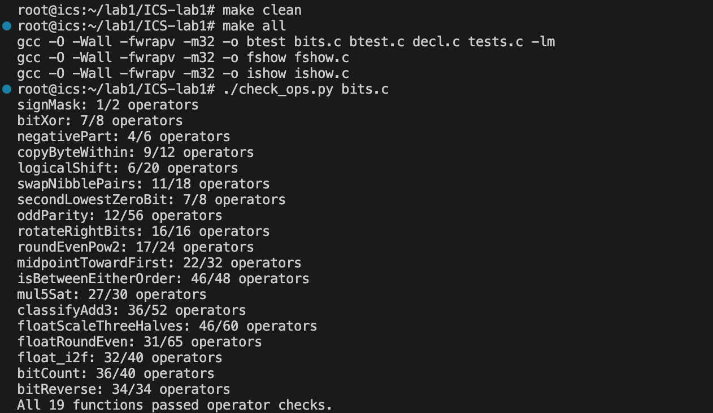

# DataLab 实验报告
李抒恩
25803050115
## 函数实现思路
1. signMask
直接将整数1左移31位，得到自由最高位为1的掩码，即0x80000000
2. bitXor
利用德摩根律实现异或，即两数不同时为1且不同时为0.因此返回~(~x & ~y) & ~(x & y)
3. negativePart
先用x >> 31得到符号掩码：负数时为全1，非负时为0。再用 ~x + 1 计算 -x，与掩码相与，所以负数返回相反数，非负数返回0。
4. copyByteWithin
把源字节号和目标字节号乘8得到移位量。取出源字节并与0xFF相与，然后构造目标字节位置为0的掩码，保留其他字节，最后把源字节移到目标位置并合并。
5. logicalShift
先做算术右移x >> n，这样高位会补符号位。随后构造一个低位为1的掩码，把算术右移带入的高位符号扩展部分清掉，从而得到逻辑右移结果.
6. swapNibbleParis
构造每个字节低4位为1的掩码。把每个字节的低4位左移4位变成高4位，把高4位右移4位变成低4位，最后或在一起完成半字节交换。
7. secondLowestZeroBit
先对x取反，使原来的0位变成1位。用y & (y - 1)去掉最低的1，相当于定位到第二个最低的0位，再用t & (~t + 1)取出最低有效位作为掩码。
8. oddParity
通过多次异或折叠，把32位中1的个数的奇偶性集中到最低位。最后判断最低位：若最低位为1，说明1的个数为奇数；题目要求偶数个1返回1，所以返回 !(x & 1)。
9. rotateRightBits
先把循环移位量限制在0～31位内。右移n_mod位后可能带符号扩展，因此用掩码保留有效低位；同时把原数左移 32 - n_mod位补到高位，两部分或起来完成循环右移。对n_mod == 0单独用掩码处理，避免重复或丢失。
10. roundEvenPow2
计算2^n、半值、商和余数。根据余数判断是否超过半值或正好等于半值，再结合商的奇偶性决定是否进位。调整后先右移再左移，得到最近的2^n倍数。
11. midpointTowardFirst
用 (x & y) + ((x ^ y) >> 1) 计算无溢出的平均基础值。当x + y为奇数时，结果本来处于中间；若x > y，需要向 x 靠近，所以额外加1。通过符号位和差值判断x是否大于y。
12. isBetweenEitherOrder
先判断端点a和b的顺序，并据此得到区间最小值min和最大值max。然后分别判断min <= x和x <= max。比较时用符号位和差值符号避免直接减法溢出，最后两个条件同时成立则返回1。
13. mul5Sat
先取x的符号掩码并计算绝对值。用阈值0x1999999A判断x * 5是否溢出。未溢出时直接返回(x << 2) + x；溢出时根据x的正负分别饱和到INT_MAX或INT_MIN。
14. classifyAdd3
分别计算x + y以及再加z时的进位，同时统计三个操作数中负数的个数。结合进位和最终截断结果的符号，判断精确和是超过INT_MAX、低于INT_MIN，还是仍在范围内，最后返回1、-1或0。
15. floatScaleThreeHalves
拆分符号、阶码和尾数。NaN和无穷直接返回原值，零也保持原符号。构造有效数M，计算3M，再根据原数是否规格化选择结果阶码。舍入时采用round-to-nearest-even，处理进位到更高阶码以及上溢为无穷的情况。
16. floatRoundEven
拆分浮点数的符号、阶码和尾数。NaN和无穷返回原值。非规格化数或绝对值太小的数舍入为带符号零。根据阶码判断小数部分位置，取出整数部分和余数，按“四舍六入五成双”决定是否进位。若进位导致阶码增加，则重新规格化后返回。
17. float_i2f
先提取符号并求绝对值。0直接返回0。找到绝对值最高有效位，确定阶码。保留24位有效数字时，根据被移出的余数进行round-to-nearest-even舍入；若尾数进位到 25位，则阶码加1。最后组合符号位、阶码和尾数。
18. bitCount
使用分治并行计数。先构造0x55555555
0x33333333、0x0F0F0F0F等掩码，依次统计每2位、每4位、每8位、每16位和每32位中的1的个数，最终得到整个32位整数中1的总数。
19. bitReverse
用分治思想反转32位。先构造相邻位、2位、4位、8位交换所需的掩码，然后依次交换相邻位、2位块、4位块、8位块，最后交换高低16位，从而得到完全逆序的位模式。
## 截图

